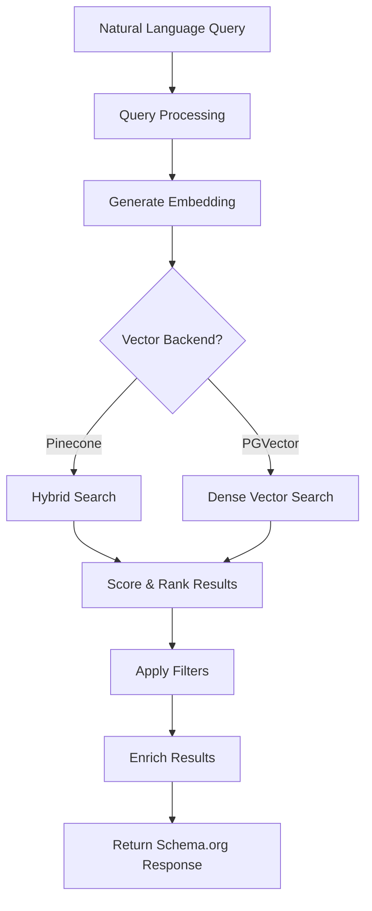

# Discovery Node Search Architecture

## Overview

The Discovery Node search API implements a sophisticated hybrid search system that combines semantic understanding with traditional filtering. This document explains how the search works, including the use of dense and sparse vectors in Pinecone, and the ranking and enrichment processes.

## Search Flow



## Query Processing Pipeline

### 1. Query Input Processing

When a search request arrives at `POST /api/v1/query/search`:

```python
{
    "query": "organic fair trade coffee beans from Colombia",
    "filters": {
        "price_min": 15,
        "price_max": 50,
        "category": "beverages",
        "in_stock": true
    },
    "limit": 20,
    "offset": 0
}
```

The system first validates and parses the query to extract:
- **Semantic intent**: The natural language meaning
- **Explicit filters**: Price ranges, categories, availability
- **Implicit filters**: Extracted from the query text (e.g., "organic", "Colombia")

### 2. Embedding Generation

The natural language query is converted into a dense vector embedding using OpenAI's text-embedding model:

```python
# Simplified embedding generation
def generate_query_embedding(query: str) -> List[float]:
    response = openai.Embedding.create(
        input=query,
        model="text-embedding-ada-002"
    )
    return response['data'][0]['embedding']  # 1536-dimensional vector
```

This dense vector captures the semantic meaning of the query in a high-dimensional space.

## Pinecone Hybrid Search

### Dense Vectors (Semantic Search)

Dense vectors are continuous, high-dimensional representations (1536 dimensions from OpenAI) that capture semantic meaning:

```python
# Example dense vector (simplified)
dense_vector = [0.0125, -0.0087, 0.0234, ..., 0.0098]  # 1536 dimensions
```

**Characteristics:**
- Captures conceptual similarity
- Understands synonyms and related concepts
- Good for "fuzzy" matching
- Language-agnostic to some degree

### Sparse Vectors (Keyword Search)

Sparse vectors are high-dimensional but mostly zero, with non-zero values for specific keywords:

```python
# Example sparse vector representation
sparse_vector = {
    "indices": [102, 405, 1823, 5012],  # Token IDs for "organic", "coffee", "colombia", "beans"
    "values": [0.8, 0.9, 0.7, 0.9]      # TF-IDF or BM25 scores
}
```

**Characteristics:**
- Exact keyword matching
- Better for specific product names, SKUs
- Handles rare terms well
- More interpretable

### Hybrid Search Implementation

In Pinecone, we combine both approaches:

```python
def hybrid_search_pinecone(query: str, filters: dict):
    # 1. Generate dense vector for semantic search
    dense_embedding = generate_query_embedding(query)
    
    # 2. Generate sparse vector for keyword search
    sparse_embedding = generate_sparse_embedding(query)  # Using BM25 or TF-IDF
    
    # 3. Perform hybrid search in Pinecone
    results = pinecone_index.query(
        vector=dense_embedding,
        sparse_vector=sparse_embedding,
        top_k=100,  # Retrieve more than needed for re-ranking
        filter={
            "organization_id": org_id,
            "in_stock": True,
            "price": {"$gte": filters.get("price_min", 0), 
                     "$lte": filters.get("price_max", float('inf'))}
        },
        include_metadata=True
    )
    
    return results
```

### Alpha Parameter (Dense vs Sparse Weight)

Pinecone allows tuning the balance between dense and sparse search:

```python
# Alpha = 1.0: Pure dense search (100% semantic)
# Alpha = 0.5: Balanced (50% semantic, 50% keyword)  
# Alpha = 0.0: Pure sparse search (100% keyword)

results = pinecone_index.query(
    vector=dense_embedding,
    sparse_vector=sparse_embedding,
    alpha=0.7,  # 70% dense, 30% sparse - good for general queries
    top_k=100
)
```

## Ranking and Scoring

### 1. Initial Scoring

Each result gets multiple scores:

```python
class SearchScore:
    vector_similarity: float    # Cosine similarity from vector search (0-1)
    keyword_relevance: float    # BM25 score from sparse search
    metadata_boost: float       # Boosts for exact matches, popularity, etc.
    filter_penalty: float       # Penalties for partial filter matches
```

### 2. Combined Score Calculation

```python
def calculate_final_score(result, query_context):
    # Base scores from vector search
    semantic_score = result.vector_similarity
    keyword_score = result.keyword_relevance if hasattr(result, 'keyword_relevance') else 0
    
    # Boost factors
    boost = 1.0
    
    # Exact title match boost
    if query_context.query.lower() in result.metadata['title'].lower():
        boost *= 1.5
    
    # Brand match boost
    if query_context.brand_filter and result.metadata['brand'] == query_context.brand_filter:
        boost *= 1.3
    
    # Recency boost (newer products score higher)
    days_old = (datetime.now() - result.metadata['created_at']).days
    recency_factor = 1.0 / (1.0 + days_old / 365)  # Decay over a year
    boost *= (1.0 + 0.2 * recency_factor)  # Up to 20% boost for new items
    
    # Popularity boost (based on view count, sales, etc.)
    popularity_score = math.log1p(result.metadata.get('view_count', 0)) / 10
    boost *= (1.0 + min(0.3, popularity_score))  # Up to 30% boost
    
    # Price competitiveness (if price filter exists)
    if query_context.price_range:
        price = result.metadata['price']
        price_range = query_context.price_range
        # Products in the middle of the range score higher
        price_position = (price - price_range[0]) / (price_range[1] - price_range[0])
        price_score = 1.0 - abs(price_position - 0.5) * 0.5
        boost *= price_score
    
    # Combine scores with weights
    final_score = (
        0.6 * semantic_score +  # 60% semantic similarity
        0.2 * keyword_score +   # 20% keyword relevance
        0.2 * boost            # 20% metadata boosts
    )
    
    return final_score
```

### 3. Re-ranking Pipeline

After initial retrieval, results go through re-ranking:

```python
def rerank_results(initial_results, query_context):
    # 1. Calculate enhanced scores
    scored_results = []
    for result in initial_results:
        score = calculate_final_score(result, query_context)
        scored_results.append((score, result))
    
    # 2. Sort by final score
    scored_results.sort(key=lambda x: x[0], reverse=True)
    
    # 3. Diversity injection (avoid too many similar products)
    final_results = inject_diversity(scored_results)
    
    # 4. Apply business rules
    final_results = apply_business_rules(final_results, query_context)
    
    return final_results
```

## Result Enrichment

### 1. Data Augmentation

Retrieved products are enriched with additional data:

```python
def enrich_product(product, organization_id):
    enriched = product.copy()
    
    # Add computed fields
    enriched['availability_status'] = compute_availability(product)
    enriched['price_range'] = get_price_range(product['offers'])
    enriched['primary_image'] = select_best_image(product['images'])
    
    # Add related data
    enriched['brand_info'] = fetch_brand_details(product['brand_id'])
    enriched['category_path'] = build_category_breadcrumb(product['category_id'])
    
    # Add search-specific metadata
    enriched['search_metadata'] = {
        'relevance_score': product._score,
        'matched_keywords': extract_matched_keywords(product, query),
        'explanation': generate_match_explanation(product, query)
    }
    
    return enriched
```

### 2. Schema.org Formatting

Results are formatted according to Schema.org standards:

```python
def format_to_schema_org(enriched_product):
    return {
        "@context": "https://schema.org",
        "@type": "Product",
        "name": enriched_product['title'],
        "description": enriched_product['description'],
        "brand": {
            "@type": "Brand",
            "name": enriched_product['brand_info']['name']
        },
        "offers": {
            "@type": "AggregateOffer",
            "priceCurrency": "USD",
            "lowPrice": enriched_product['price_range']['min'],
            "highPrice": enriched_product['price_range']['max'],
            "availability": enriched_product['availability_status']
        },
        "aggregateRating": enriched_product.get('rating', None),
        "image": enriched_product['primary_image']
    }
```

## Optimization Techniques

### 1. Query Expansion

For better recall, queries are expanded:

```python
def expand_query(original_query):
    # Add synonyms
    synonyms = get_synonyms(original_query)  # "coffee" -> ["java", "espresso", "brew"]
    
    # Add related terms
    related = get_related_terms(original_query)  # "organic" -> ["natural", "eco-friendly"]
    
    # Create expanded query
    expanded = f"{original_query} {' '.join(synonyms)} {' '.join(related)}"
    
    return expanded
```

### 2. Negative Sampling

To improve relevance, we identify what the user doesn't want:

```python
def extract_negative_keywords(query):
    # Common negative patterns
    negative_patterns = [
        r"not?\s+(\w+)",
        r"without\s+(\w+)",
        r"except\s+(\w+)"
    ]
    
    negatives = []
    for pattern in negative_patterns:
        matches = re.findall(pattern, query, re.IGNORECASE)
        negatives.extend(matches)
    
    return negatives
```

### 3. Caching Strategy

Frequently searched queries are cached:

```python
def cached_search(query, filters, cache_ttl=3600):
    cache_key = generate_cache_key(query, filters)
    
    # Check cache first
    cached_result = redis_client.get(cache_key)
    if cached_result:
        return json.loads(cached_result)
    
    # Perform search
    results = perform_hybrid_search(query, filters)
    
    # Cache results
    redis_client.setex(
        cache_key,
        cache_ttl,
        json.dumps(results)
    )
    
    return results
```

## Performance Considerations

### 1. Index Optimization

- **Pinecone**: Indexes are optimized for approximate nearest neighbor search
- **Metadata Filtering**: Pre-filter at the index level for efficiency
- **Batch Operations**: Embeddings are generated and indexed in batches

### 2. Query Performance

- **Lazy Loading**: Only fetch full product details for returned results
- **Pagination**: Use cursor-based pagination for large result sets
- **Timeout Handling**: Set reasonable timeouts for vector searches

### 3. Scalability

- **Horizontal Scaling**: Multiple search service instances
- **Index Sharding**: Partition by organization for multi-tenant scale
- **Read Replicas**: Distribute search load across replicas

## Example: Complete Search Flow

Here's how a search for "sustainable running shoes under $100" works:

1. **Query Analysis**
   - Extract intent: "running shoes"
   - Extract attributes: "sustainable"
   - Extract constraints: "under $100"

2. **Vector Generation**
   - Dense: Semantic embedding of entire query
   - Sparse: Keywords ["sustainable", "running", "shoes"]

3. **Pinecone Search**
   - Hybrid search with alpha=0.7
   - Pre-filter: price <= 100
   - Retrieve top 100 candidates

4. **Ranking**
   - Base scores from Pinecone
   - Boost for "sustainable" in title/description
   - Boost for running shoe category
   - Penalize if over $100

5. **Enrichment**
   - Add brand details
   - Calculate availability
   - Format prices
   - Add sustainability badges

6. **Response**
   - Return top 20 results
   - Include facets for filtering
   - Provide search explanation

This architecture provides fast, relevant search results while maintaining flexibility for different types of queries and use cases.