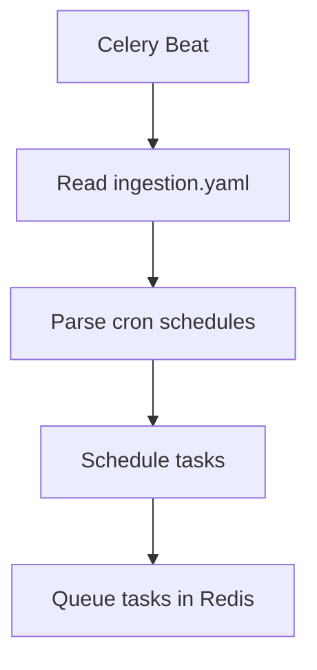
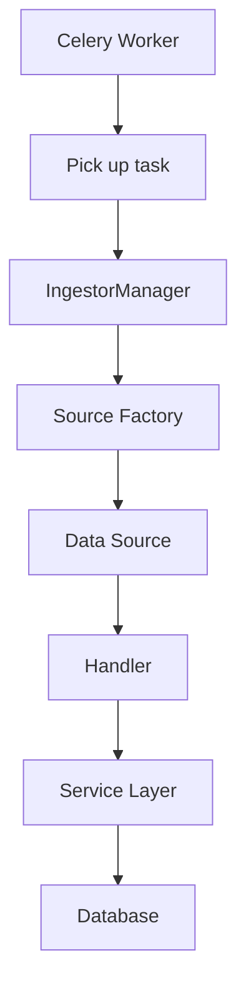
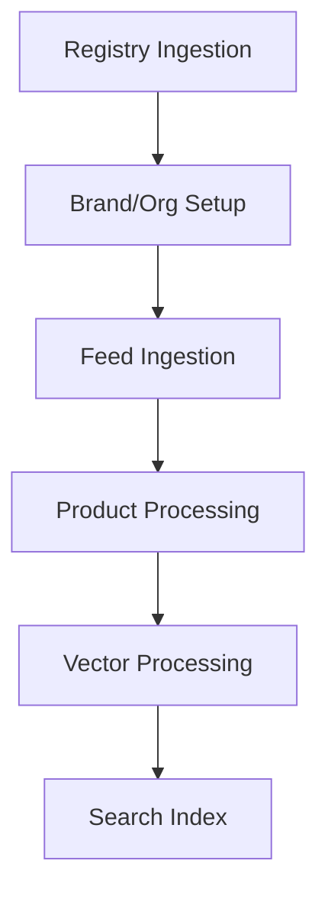

# Worker and Ingestion System

This document explains the worker and ingestion system architecture, job flow, and how data processing works in the discovery-node project.

## 🏗️ System Architecture

The ingestion system follows a **distributed task processing** architecture using Celery:

```
┌─────────────────┐    ┌─────────────────┐    ┌─────────────────┐
│   Celery Beat   │    │   Celery Worker │    │   Redis Broker  │
│   (Scheduler)   │    │   (Processor)   │    │   (Message Q)   │
└─────────────────┘    └─────────────────┘    └─────────────────┘
         │                       │                       │
         │                       │                       │
         ▼                       ▼                       ▼
┌─────────────────┐    ┌─────────────────┐    ┌─────────────────┐
│   Ingestor      │    │   Data Sources  │    │   PostgreSQL    │
│   Manager       │    │   (Local/Remote)│    │   Database      │
└─────────────────┘    └─────────────────┘    └─────────────────┘
         │                       │                       │
         │                       │                       │
         ▼                       ▼                       ▼
┌─────────────────┐    ┌─────────────────┐    ┌─────────────────┐
│   Handlers      │    │   Vector        │    │   Services      │
│   (Feed/Reg)    │    │   Processing    │    │   (Business)    │
└─────────────────┘    └─────────────────┘    └─────────────────┘
```

## 📁 Directory Structure

```
app/
├── worker/
│   ├── celery_app.py      # Celery application configuration
│   ├── schedulers.py      # Task scheduling definitions
│   └── tasks/
│       ├── ingest.py      # Ingestion tasks
│       └── cleanup.py     # Maintenance tasks
└── ingestors/
    ├── manager.py         # Orchestration manager
    ├── base.py           # Base classes and utilities
    ├── sources/
    │   ├── factory.py    # Source factory
    │   ├── base.py       # Base source class
    │   └── local.py      # Local file source
    └── handlers/
        ├── feed.py        # Product feed handler
        ├── registry.py    # Brand registry handler
        └── vector.py      # Vector processing handler
```

## 🔄 Job Flow Overview

### 1. **Scheduling Phase**


### 2. **Execution Phase**


### 3. **Processing Pipeline**


## 🎯 Core Components

### 1. **Celery Application (`app/worker/celery_app.py`)**

#### Responsibilities
- Configure Celery worker and broker
- Set up task routing and serialization
- Handle worker lifecycle events
- Load scheduled tasks from configuration

#### Key Features
```python
# Celery configuration
celery_app = Celery(
    "cmp_discovery",
    broker=settings.CELERY_BROKER_URL,
    backend=settings.CELERY_RESULT_BACKEND,
    include=["app.worker.tasks.ingest", "app.worker.tasks.cleanup"]
)

# Task configuration
celery_app.conf.update(
    task_serializer="json",
    accept_content=["json"],
    result_serializer="json",
    timezone="UTC",
    enable_utc=True,
    worker_prefetch_multiplier=1,
    task_acks_late=True,
    task_time_limit=3600,  # 1 hour time limit
    task_soft_time_limit=3300,  # 55 minutes soft limit
)
```

### 2. **Task Scheduler (`app/worker/schedulers.py`)**

#### Responsibilities
- Parse `ingestion.yaml` configuration
- Generate Celery Beat schedules
- Handle cron schedule parsing
- Create scheduled tasks dynamically

#### Configuration Example
```yaml
# ingestion.yaml
ingestion:
  - name: "acme-corp"
    source_type: "local"
    registry: "samples/acme-solutions/brand-registory.json"
    feed_path: "samples/acme-solutions/feed/feed.json"
    schedule: "0 */4 * * *"  # Every 4 hours
```

#### Schedule Generation
```python
def get_beat_schedule():
    schedule = {
        "check-feed-updates": {
            "task": "ingest:check_feed_updates",
            "schedule": timedelta(seconds=settings.FEED_CHECK_INTERVAL),
            "options": {"expires": 3600}
        }
    }
    
    # Add ingestion tasks from configuration
    for ingestor in config["ingestion"]:
        task_name = f"ingest-all-{ingestor['name']}"
        schedule[task_name] = {
            "task": "ingest:all",
            "schedule": crontab(...),
            "args": (ingestor["name"], ingestor["source_type"], ...),
            "options": {"expires": 3600}
        }
    
    return schedule
```

### 3. **Ingestion Tasks (`app/worker/tasks/ingest.py`)**

#### Main Tasks

##### `ingest:all`
- **Purpose**: Complete ingestion pipeline for an ingestor
- **Flow**: Registry → Feed → Vector processing
- **Error Handling**: Stops on first failure, retries with exponential backoff
- **Configuration**: 3 retries, 5-minute delay between retries

```python
@shared_task(name="ingest:all", bind=True, max_retries=3, default_retry_delay=300)
def ingest_all(self, ingestor_name, source_type, registry_path=None, feed_path=None):
    """
    Sequentially ingest registry, feed, and vector for a given ingestor.
    Each step only runs if the previous one succeeded.
    """
    try:
        manager = IngestorManager()
        results = {}
        
        # 1. Registry ingestion
        if registry_path:
            registry_result = manager.ingest_registry(source_type, registry_path)
            results["registry"] = {"status": "success", "result": registry_result}
        
        # 2. Feed ingestion
        if feed_path:
            feed_result = manager.ingest_feed(source_type, feed_path)
            results["feed"] = {"status": "success", "result": feed_result}
        
        # 3. Vector processing
        if registry_path:
            vector_result = manager.ingest_vector(source_type, registry_path)
            results["vector"] = {"status": "success", "result": vector_result}
        
        return {"status": "success", "results": results}
    except Exception as e:
        logger.exception(f"Error in full ingestion for {ingestor_name}: {e}")
        return {"status": "error", "step": "unknown", "error": str(e)}
```

##### `ingest:registry`
- **Purpose**: Process brand registry data
- **Data**: Organization, brand, and category information
- **Output**: Database records for brands and organizations

##### `ingest:feed`
- **Purpose**: Process product feed data
- **Data**: Product groups, products, and offers
- **Output**: Database records for products and offers
- **Trigger**: Automatically triggers vector processing after completion

##### `ingest:vector`
- **Purpose**: Process vector embeddings for search
- **Data**: Product data from database
- **Output**: Pinecone vector embeddings
- **Dependencies**: Requires registry data for brand/category context

##### `ingest:check_feed_updates`
- **Purpose**: Check for feed updates
- **Schedule**: Runs every `FEED_CHECK_INTERVAL` seconds
- **Action**: Detects changes and triggers re-ingestion

### 4. **Ingestor Manager (`app/ingestors/manager.py`)**

#### Responsibilities
- Orchestrate the ingestion process
- Manage database sessions
- Handle source creation and data fetching
- Coordinate between different handlers
- Track processing statistics and timing

#### Key Methods

```python
class IngestorManager:
    def get_ingestors(self) -> List[Dict[str, Any]]:
        """Load ingestor configurations from YAML file"""
        
    def ingest_registry(self, source_type: str, registry_path: str) -> Dict[str, Any]:
        """Process brand registry data"""
        
    def ingest_feed(self, source_type: str, feed_path: str) -> Dict[str, Any]:
        """Process product feed data"""
        
    def ingest_vector(self, source_type: str, registry_path: str) -> Dict[str, Any]:
        """Process vector embeddings"""
```

### 5. **Data Sources (`app/ingestors/sources/`)**

#### Source Factory Pattern
```python
class SourceFactory:
    @staticmethod
    def create(source_type: str, config: Optional[Dict[str, Any]] = None) -> BaseSource:
        if source_type == "local":
            return LocalSource(config)
        # elif source_type == "remote":
        #     return RemoteSource(config)
        # elif source_type == "ftp":
        #     return FtpSource(config)
        else:
            raise SourceError(f"Unknown source type: {source_type}")
```

#### Supported Sources
- **LocalSource**: Read from local filesystem
- **RemoteSource**: Fetch from HTTP/HTTPS URLs (planned)
- **FtpSource**: Fetch from FTP servers (planned)

#### Base Source Interface
```python
class BaseSource:
    def fetch(self, path: str) -> str:
        """Fetch data from source and return as string"""
        raise NotImplementedError
```

### 6. **Data Handlers (`app/ingestors/handlers/`)**

#### Registry Handler (`registry.py`)
- **Purpose**: Process brand registry data
- **Input**: JSON-LD organization data
- **Output**: Database records for organizations, brands, and categories
- **Validation**: Ensures CMP compliance

#### Feed Handler (`feed.py`)
- **Purpose**: Process product feed data
- **Input**: JSON-LD product feed data
- **Output**: Database records for products, product groups, and offers
- **Features**: Handles sharded feeds, brand resolution, category processing

#### Vector Handler (`vector.py`)
- **Purpose**: Process vector embeddings
- **Input**: Product data from database
- **Output**: Pinecone vector embeddings
- **Features**: Batch processing, error handling, progress tracking

## 🔄 Data Processing Flow

### 1. **Registry Processing**
```
JSON-LD Registry → Validation → Brand Service → Database
       ↓
Organization → Brands → Categories
```

### 2. **Feed Processing**
```
JSON-LD Feed → Validation → Product Service → Database
       ↓
Product Groups → Products → Offers
```

### 3. **Vector Processing**
```
Database Products → Vector Service → Pinecone
       ↓
Search Index → Semantic Search
```

## 🛠️ Error Handling and Retries

### Task-Level Retries
```python
@shared_task(
    name="ingest:all",
    bind=True,
    max_retries=3,
    default_retry_delay=300  # 5 minutes
)
def ingest_all(self, ...):
    try:
        # Processing logic
        pass
    except Exception as e:
        # Retry with exponential backoff
        retry_count = self.request.retries
        if retry_count < self.max_retries:
            self.retry(exc=e)
```

### Error Types
- **SourceError**: Data source issues (file not found, network errors)
- **ValidationError**: Data format or CMP compliance issues
- **ProcessingError**: Business logic or database errors
- **IngestorError**: General ingestion errors

### Error Recovery
- **Automatic retries** with exponential backoff
- **Graceful degradation** (skip failed steps)
- **Detailed logging** for debugging
- **Error reporting** to monitoring systems

## 📊 Monitoring and Observability

### Task Monitoring
- **Celery Flower**: Web-based monitoring for Celery tasks
- **Task results**: Stored in Redis/PostgreSQL backend
- **Logging**: Comprehensive logging at each step
- **Metrics**: Processing time, success rates, error counts

### Health Checks
```python
@shared_task(name="ingest:check_feed_updates")
def check_feed_updates():
    """Check for feed updates and trigger re-ingestion if needed"""
    try:
        manager = IngestorManager()
        ingestors = manager.get_ingestors()
        
        for ingestor in ingestors:
            if manager.has_feed_updates(ingestor["source_type"], ingestor["feed_path"]):
                # Trigger re-ingestion
                ingest_all.delay(...)
                
        return {"status": "success", "checked": len(ingestors)}
    except Exception as e:
        logger.exception(f"Error checking feed updates: {e}")
        return {"status": "error", "message": str(e)}
```

## 🧹 Cleanup Tasks (`app/worker/tasks/cleanup.py`)

### Maintenance Tasks

#### `cleanup:old_products`
- **Purpose**: Remove old deleted products
- **Schedule**: Daily
- **Retention**: Configurable retention period (default: 30 days)

#### `cleanup:orphaned_data`
- **Purpose**: Remove orphaned database records
- **Scope**: Categories, associations, empty records
- **Safety**: Configurable deletion rules

#### `cleanup:celery_tasks`
- **Purpose**: Clean up old Celery task results
- **Retention**: Configurable retention period (default: 7 days)
- **Performance**: Prevents database bloat

## 🚀 Deployment and Operations

### Starting the System

#### 1. Start Celery Worker
```bash
# Development
celery -A app.worker.celery_app worker --loglevel=info

# Production
celery -A app.worker.celery_app worker --loglevel=info --concurrency=4
```

#### 2. Start Celery Beat (Scheduler)
```bash
# Development
celery -A app.worker.celery_app beat --loglevel=info

# Production
celery -A app.worker.celery_app beat --loglevel=info --scheduler=django_celery_beat.schedulers:DatabaseScheduler
```

#### 3. Monitor with Flower
```bash
celery -A app.worker.celery_app flower --port=5555
```

### Configuration

#### Environment Variables
```env
# Celery Configuration
CELERY_BROKER_URL=redis://localhost:6379/0
CELERY_RESULT_BACKEND=redis://localhost:6379/0

# Ingestion Configuration
FEED_CHECK_INTERVAL=300
EMBEDDING_UPDATE_INTERVAL=3600
CLEANUP_INTERVAL=3600
INGESTION_CONFIG_PATH=/path/to/ingestion.yaml
TRIGGER_INGESTION_ON_STARTUP=false

# Pinecone Configuration
PINECONE_API_KEY=your_api_key
PINECONE_ENVIRONMENT=your_environment
PINECONE_DENSE_INDEX=your_dense_index
PINECONE_SPARSE_INDEX=your_sparse_index
```

#### Ingestion Configuration
```yaml
# ingestion.yaml
ingestion:
  - name: "acme-corp"
    source_type: "local"
    registry: "samples/acme-solutions/brand-registory.json"
    feed_path: "samples/acme-solutions/feed/feed.json"
    schedule: "0 */4 * * *"  # Every 4 hours
    
  - name: "another-brand"
    source_type: "local"
    registry: "samples/another-brand/registry.json"
    feed_path: "samples/another-brand/feed.json"
    schedule: "0 2 * * *"  # Daily at 2 AM
```

## 🔧 Development and Testing

### Manual Task Execution
```python
# Execute tasks manually
from app.worker.tasks.ingest import ingest_all

# Run ingestion for specific ingestor
result = ingest_all.delay("acme-corp", "local", "path/to/registry.json", "path/to/feed.json")

# Check result
print(result.get())  # Wait for completion and get result
```

### Testing
```python
# Test individual components
from app.ingestors.manager import IngestorManager

manager = IngestorManager()
result = manager.ingest_registry("local", "test_registry.json")
print(result)
```

### Debugging
- **Task logs**: Check Celery worker logs
- **Database**: Monitor database operations
- **Redis**: Check message queue status
- **Pinecone**: Monitor vector index operations

## 📈 Performance Considerations

### Optimization Strategies
1. **Batch processing**: Process multiple items in batches
2. **Parallel processing**: Use multiple workers
3. **Caching**: Cache frequently accessed data
4. **Database optimization**: Use bulk inserts and updates
5. **Memory management**: Process large files in chunks

### Scaling
- **Horizontal scaling**: Add more Celery workers
- **Vertical scaling**: Increase worker concurrency
- **Database scaling**: Use read replicas for queries
- **Vector scaling**: Use Pinecone's auto-scaling

This architecture provides a robust, scalable, and maintainable system for processing CMP data feeds with proper error handling, monitoring, and operational support. 